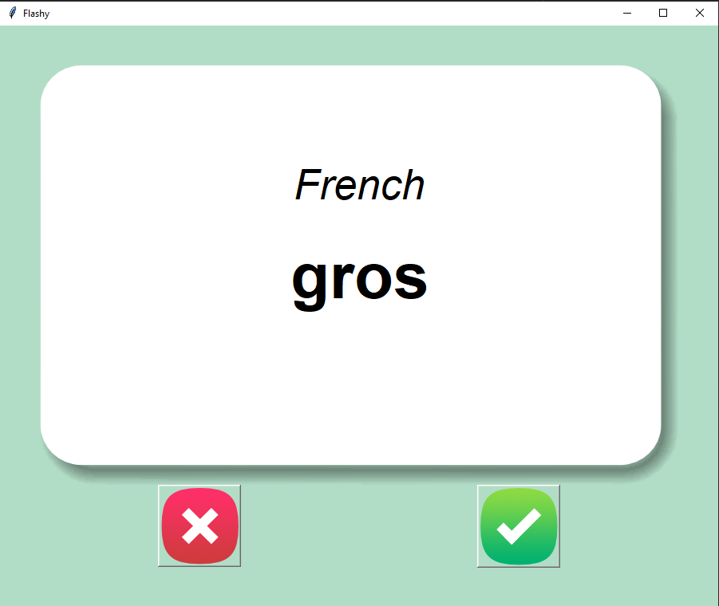
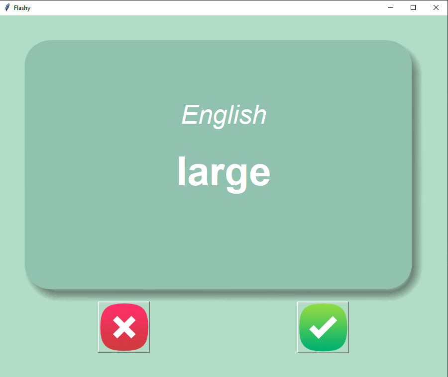

# Flase-Card-App-Capstone
A game for learning a language in an intuitive and fun way.

First screen shows the target language. After three seconds, It flips to show the English meaning. If user clicks on check mark, remove the word from the list and don't show it the next time.

# images 

the target language screen

the English meaning screen

